#### This directory includes a slideshow presentation with audio narration that covers migrating an app to the cloud and developing the infrastructure for which it runs upon. I include many screenshots of the work I did for a fullstack application that was migrated to AWS (Amazon Web Services).
 
YouTube Presentation (4K/1080p): https://youtu.be/ZFK7QFrVsK0
  

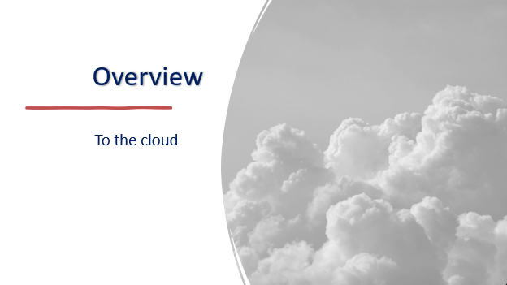
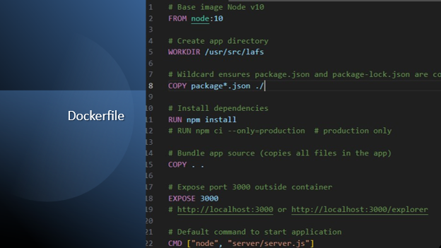
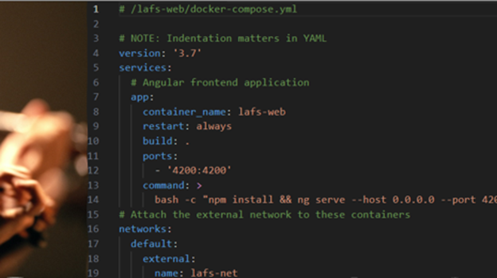s
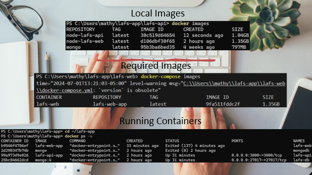
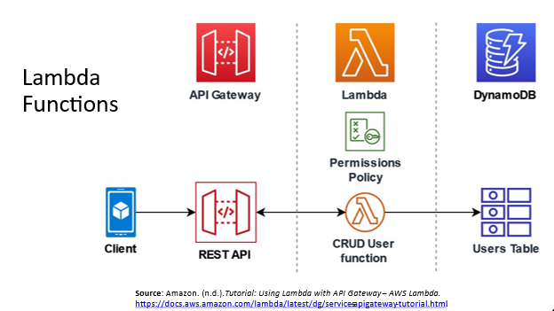
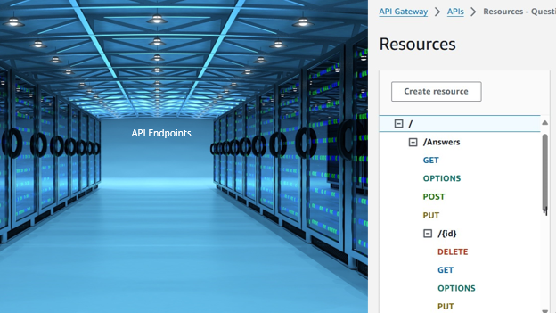
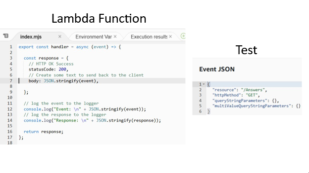
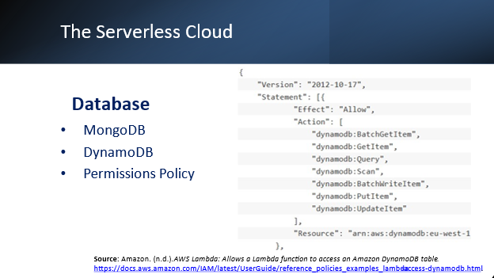
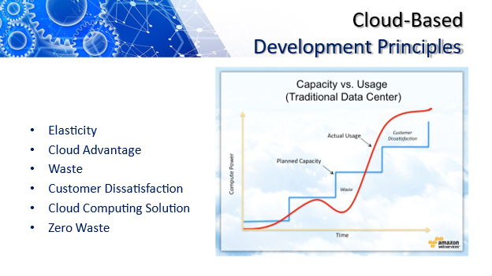
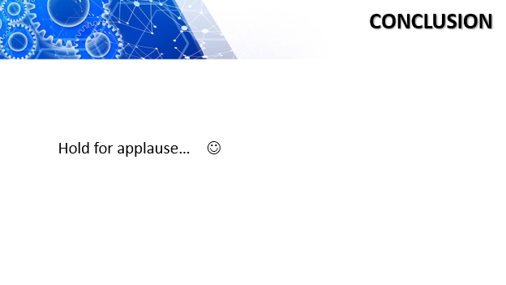
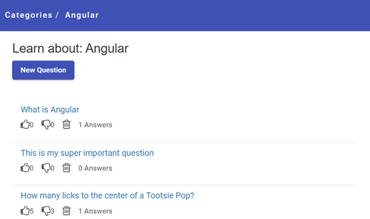
