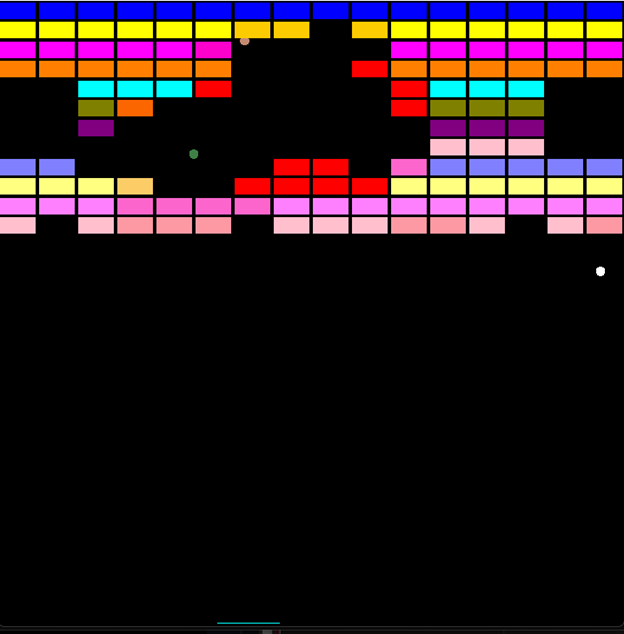

### TO RUN “Super Mario Bros” or “Breakout”:
1.	Download ZIP
2.	Extract ZIP (optional)
3.	Open "RUN TO START" in project root directory

* Super Mario Bros allows switching between a 2D (1st image) and 3D (2nd image) view.

NOTE: Microsoft Visual C++ Redistributables or other dependencies may be required.

