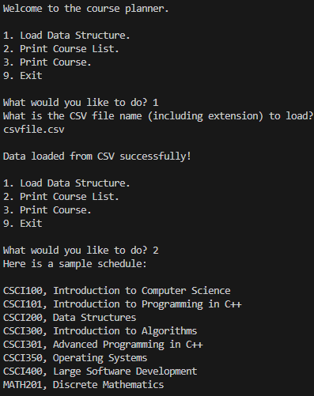
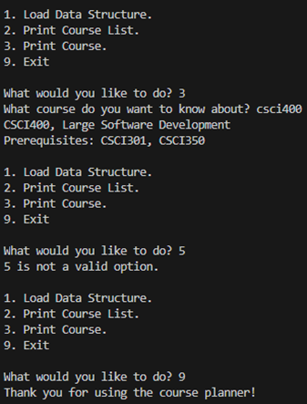

### TO RUN: 
     1. Download ZIP
     2. Run 'driver.exe'
     3. Select option 1
     4. Enter "csvFile.csv"
     5. Press <Enter>
     6. Select another option
 
### Design & Development 

The program we were creating was initially designed using various data structures, including vector, hash table, and binary search tree. The focus was on loading data (courses) from an input CSV file into each of these data structures, and then printing a sorted list of courses to the default console output and allowing a course to be found using a specific course number entered by the user. The problem involved finding the most efficient runtime complexity of the three data structures, when it came to loading the CSV data into each of them. Different data structures use varying amounts of space and time (memory and processing) to perform the same tasks. As the size of the input grows, these requirements can significantly increase. It is important to be efficient when it comes to software design, as performance can be detrimentally impacted by poor execution of data structure choice.

When approaching the design for this program, it was crucial to understand the processes/functions necessary for the requirements and to understand the capabilities and limitations of the various data structures considered. Hash tables have a relatively high memory overhead due to buckets and the mechanism for handling collisions, like using linked lists with nodes and pointers. Binary Search Trees (BSTs) need to be balanced, which can lead to higher runtime complexities. Vectors have relatively low memory overhead and can be dynamically resized when needed. Vectors also use contiguous memory and are cache-friendly with index access in O(1) constant time.  Due to its efficiency, simplicity, and ability to be sorted, I ended up using the vector data structure for this project. After refactoring my code, I optimized the runtime complexity, changing from O(n^2 x m) down to O(n x m), simply by removing the most inner-nested loop and creating a list of only the course numbers to iterate over during prerequisite validation.

Data structure and algorithm runtime and space complexity were not things I had really thought much about before developing this program. Now I see how quickly memory and space utilization can grow when not considered in the design process. I can now make more intelligent decisions when designing and developing code, taking into account that the type of data structures and algorithms can drastically affect the efficiency of my program, including user experience and maximum potential performance. This project has added to my obsession over trying to write the cleanest and most maintainable and understandable code possible, as well as keeping modularity, abstraction, encapsulation, polymorphism, and other important software engineering concepts in mind!
