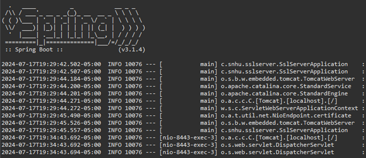

# Artemis Financial & Security 

Artemis Financial is a financial planning/consulting company that operates on a global level and is responsible for quite an impressive and diverse portfolio, including savings and retirement accounts, investments, and insurance. At Global Rain, our mission statement says, “Security is everyone’s responsibility”, and we truly believe that! New security vulnerabilities are continually being discovered and new, innovative, and creative ways to counter them are constantly being created. Because Artemis Financial works at an international level involving financial transactions and government agencies (and other businesses), their “rest-service” software requires more than the typical RESTful web Application Programming Interface (API), such as the compliancy with the following domestic and international laws (including financial sector regulations):
* (GLBA) Gramm-Leach-Bliley Act: U.S. Law for financial info management & data protection
* (SOX) Sarbanes-Oxley Act: U.S. law for data integrity & confidentiality
* (MiFID II) Markets in Financial Instruments Directive II: European transparency regulations
* (PSD2) Revised Payment Service Directive: European directive for payment services
* (GDPR) General Data Protection Regulation: European Union law for data protection
* (FISMA) Federal Information Security Management Act: U.S. law for federal data systems
* Other industry- and regional-specific laws like HIPAA (Health Insurance Portability & Accountability Act)  
To secure the client’s data, the software application required encryption for the data and a hashing algorithm to produce the checksum. AES-256 was implemented to secure the data in the application, and SHA-256 was used for hashing. There was no input or untrusted data to validate or sanitize or otherwise be concerned with. A 2048-bit RSA Certificate Authority (CA) was created with TLS (Transport Layer Security) secured communication between the client and server. The Spring Boot Framework, as well as all plugins and dependencies, were updated (via pom.xml and mvn commands) and vulnerabilities checked with OWASP’s Dependency Check (Maven). I also implemented custom error messages instead to avoid exposing any sensitive information that may be in built-in error handling. 

   
Following industry standard best practices for secure coding is crucial in order to protect software application security, as well as the overall well-being of the company at risk. Web applications are inherently vulnerable to DoS (Denial-of-Service), injection attacks, cross-site scripting (XSS), cross-site request forgery (CSRF), URL open redirects, unauthorized access, and other attacks. An organization’s reputation can be damaged and never salvaged, leading to great financial loss or even complete loss of the business itself. This is why it is critical to make software security one of the top priorities, as well as following industry standards best practices when designing, implementing, and maintaining software systems of any kind.
I think the most helpful part was having the experience of just working through it all and figuring it out. It was a tedious process, but working with these vulnerability assessment tools is a valuable learning experience.  
Securing a software application requires multiple layers of security, especially with web applications, as web apps typically have numerous components interacting with each other. Proper authentication and authorization checks should typically be integrated at various endpoints, as well as input validation/sanitization and rate limiting implementation. With the Artemis Financial web app, a 2048-bit RSA encryption and a strong password were used in creating the CA (Certificate Authority) and initiating the TLS connection from the client browser to the web server. The application.properties file was edited to utilize port 8443 for TLS (Transport Layer Security)  and HTTPS (Hypertext Transfer Protocol Secure) to provide a secure communications channel.  
Additionally, updates were made to the Spring Framework, OWASP Dependency-Check, Maven, and other libraries, dependencies, and plugins by running appropriate CLI (Command Line Interface) mvn commands and editing the pom.xml file. OWASP’s Dependency-Check was also used to identify any known dependency vulnerabilities that existed within the project. Finally, before presenting (or transmitting) any sensitive data to the client’s browser, AES-256 encryption was used to encrypt the data, which was then hashed using the SHA-256 hashing algorithm. These multiple layers of security are necessary to provide protection against various exploits that exist inherently in RESTful web software applications.    
As a software developer, it is important to ensure correct functionality and security in your program. Manual review and automated testing must be effectively integrated at the unit, integration, and end-to-end system levels. This includes static (non-executing) and dynamic (executing) testing, as well as regression testing to ensure updates do not break previously-working code. Automated testing can be implemented to support frequent software updates/releases, as part of a Continuous Integration/Continuous Deployment (CI/CD) framework.    
Proper security requires different methods to be used in conjunction with each other. Some common strategies include the following:
* input validation/sanitization
* session management
* authentication and authorization (access control)
* secure communication and proper key management
* PoLP/PoLA (Principle of Least Privilege/Authority)
* parameterized queries
* HTTPS and TLS SSL
* proper RSA/AES encryption
* proper SHA hashing
* proper error handling
* updated framework, plugins, dependencies, libraries, APIs  
Following the guidelines set forth by the aforementioned resources provides the foundation for functional and secure software development. A Test-Driven Approach (TDD) is often used in many iterative software development approaches, as seen in agile frameworks like Scrum, and is proven to be quite effective for developing robust software. After refactoring code to fix vulnerabilities, it is crucial to run Dependency Check again to see if any other vulnerabilities have been introduced.  
The following resources can be referenced for security-related vulnerabilities and mitigation strategies:
* OWASP (Open Web Application Security Project)
* NIST (National Institute of Standards & Technology)
* CERT (Computer Emergency Response Team)
* ISO/IEC (Intl. Organization for Standardization/Intl. Electrotechnical Commission)
* Oracle
* CWE (Common Weakness Enumeration)
* CVE (Common Vulnerabilities & Exposures)  
A few of the U.S. governmental compliancy regulations and laws for data integrity and security are composed of the following:
* SOX (Sarbanes-Oxley Act)
* FISMA (Federal Information Security Management Act)
* HIPAA (Health Insurance Portability & Accountability Act)
* FISMA (Federal Information Security Management Act)  
I have included the SslServerApplication.java file in this repository to show the specific file that was refactored. AES-256 encryption was used to secure the String data, and SHA-256 was used for the hashing algorithm to produce the checksum value.  
Thank you for your time.
