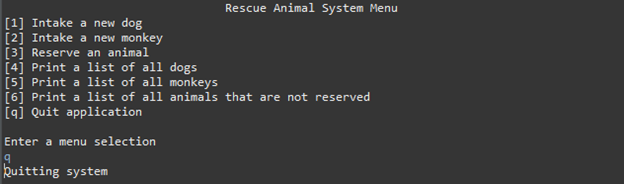

# To Run: 
1. Download 'Rescue Animal.zip'
2. Extract 'Rescue Animal.zip'
3. Open 'Rescue Animal' folder in an IDE (like Visual Studio Code)
4. Run src/rescueAnimal/Driver.java

# Rescue Animal (Java)
This is a simple program to add and remove dogs and monkeys and their associated attributes. The user may also print out this data as various formatted lists.

