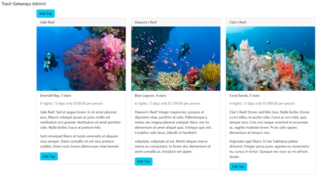
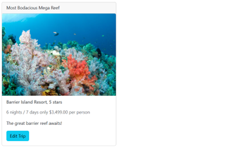
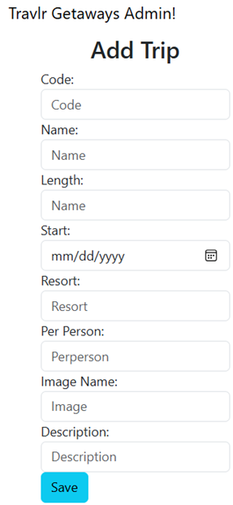
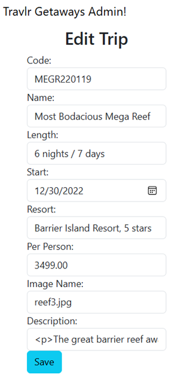

#### 'Travlr' web app started using the following GitHub repositories:
* https://github.com/AngularTemplates/learn-angular-from-scratch-step-by-step
* https://github.com/AngularTemplates/learn-how-to-build-a-mean-stack-application
  

## <strong>Table of Contents</strong>
* [Architecture](#architecture)
* [Functionality](#functionality)
* [Testing](#testing)
* [User Interface](#user-interface)
* [Reflection](#reflection)
* [To Run](#to-run)   

## Architecture
### Introduction
The admin site for Travlr Getaways consists of a client-based single-page application (SPA) web page that uses [Bootstrap CSS](https://getbootstrap.com) and [Angular](https://angular.dev), which provides reusable UI components and logic. The architecture, functionality, and testing of the SPA site can be better understood by the following information. 
Angular vs Express Frameworks
The customer-facing site consists of [Node.js](nodejs.org) used in conjunction with the [Express.js](https://expressjs.com) framework, which consists of HTML pages served from (and rendered in) the server, which utilizes [JavaScript](https://simple.wikipedia.org/wiki/JavaScript). The Express router manages server-side routing, while client-side routing is managed by RouterModule. Middleware is used for request handling, HTTP responses, and other functionality.
The Angular-based admin-facing website consists of a modular architecture that includes routes, modules, services, and components. Components consist of [HTML](https://en.wikipedia.org/wiki/HTML), [CSS](https://en.wikipedia.org/wiki/CSS), and [TypeScript](https://www.typescriptlang.org/) files. TypeScript is a JavaScript superset that includes type safety to help catch data type errors at compile time.
### Handlebars
[Handlebars](https://handlebarsjs.com/) (HBS) was implemented to add dynamic content to the site using a [JSON](https://en.wikipedia.org/wiki/JSON) file to define relevant data. Handlebars is a JS templating language that uses a template and input object to generate Dynamic HTML (hypertext markup language) content by separating the presentation layer from the logic layer. Handlebars also makes it possible to create reusable template components, like headers and footers. JSON (JavaScript object notation) is a text format that is language independent and easy to read.
### Mongoose Middleware
The middleware in [MongoDB](https://www.mongodb.com/) ([NoSQL](https://en.wikipedia.org/wiki/NoSQL)) database is used with [Mongoose](https://mongoosejs.com/docs/middleware.html) – an Object Data Modeling (ODM) library for MongoDB and Node.js. Middleware provides a way to automatically perform actions before or after certain events in the lifecycle of database operations, including interactions with database models and schemas. Mongoose is used to connect the Express app to the MongoDB (NoSQL) database and is directly added to the app dependencies section in package.json, using ‘npm i mongoose’ in the terminal. Mongoose is used to define schemas, consisting of any number of paths (data entities) that define the data (structure) in each associated document. The schema compiles into a model in which a single instance of the model maps directly to a single database instance, allowing CRUD operations (Create, Read, Update, Delete). Middleware functions (hooks) include those for data validation, logging, resource cleanup, and other functions. Pre-middleware runs before lifecycle events using save, validate, and remove, while post-middleware runs after lifecycle events using log or next, for example
### Single-Page Applications (SPAs)
A SPA is a type of web page that loads a single document, and then updates the body content via JS APIs like Fetch. SPAs provide fast and responsive pages due to client-side caching and the fact that the page doesn’t need fully-reloaded. This results in increased performance and better user experience. However, since the page renders client-side, it is challenging to optimize for search engines (SEO). Since the entire app is downloaded to the user’s device, there may be an increased initial load time.
SPAs, like most other web applications, have CRUD (Create, Read, Update, Delete) functionality to interact with a database, like MongoDB (accessed via Mongoose). MongoDB is considered a NoSQL database. This allows for a dynamic, schema-less structure for the documents (data) stored in the database. NoSQL databases also provide horizontal scalability and high performance read and write operations, due to its non-relational data model.

## Functionality
### JSON & JavaScript
JSON (JavaScript Object Notation) is a lightweight data interchange format that is easy for humans to read and write. The format is easily parsed and generated by code and machines. JSON is primarily used to transmit data between the server (Express backend) and web application (Angular frontend). JSON is a subset of JavaScript using key-value pairs and supports strings, numbers, objects, arrays, Booleans, and null. JavaScript (JS) is a high-level, interpreted programming language used extensively in World Wide Web (www) technologies. It is used in conjunction with CSS files (for styling) and HTML for structured data that the user sees. JS allows for dynamic content and event-driven user interactions. The user’s web browser sends a secure HTTP request to the server using a JWT (JSON Web Token) and the server responds back with another JWT. JWTs are stateless and secure and offer easy scalability across multiple servers due to no shared session state being needed. 
### Refactorization & Modularization
It’s always nice to keep things simple. After developing a bit of code, code can get messy. This is where refactorization comes into play. Refactoring your code just means better organizing the code without changing any functionality. Adding various components, or modules, can help with this type of organization. In addition to this benefit, modularization allows for reusing code where possible. Don’t repeat yourself. An example of this is having a set of identical UI components such as a header and footer in a web page. To avoid duplicating your code, the code can be modularized and called when needed. I performed these steps for my header and footer. After moving the header and footer data into HBS partials (fragments), each can be accessed from other files by using the {{> header}} or {{> footer}} notations, respectively. Using the Handlebars directive {{#each}}, an HBS file can iterate over each item in the JSON file. This can be used to create lists and menus using the JSON file contents. The JSON file is parsed within a controller file, which is to use the built-in Node.js file system component. Refactorization and modularization is continually executed throughout the entire development process. 

## Testing
### Postman
Methods for request and retrieval require several types of API testing of various endpoints. [Postman](https://www.postman.com/) is an app commonly used to assess RESTful APIs and web pages using HTTP methods like POST, GET, PUT, and DELETE. After starting your web server and opening Postman, you can select the HTTP GET (Read) method type from the drop-down, input the API endpoint (URL) of the resource, and click the “Send” button. Postman displays the returned status code and (JSON, HTML, etc.) data retrieved from the (MongoDB) database. To evaluate the PUT (Create) method, follow the same steps as the GET method requires, after entering in any number of key-value pairs into the “Query Params” section. If there are errors, a status code indicating an error, as well as debugging text, will appear instead. Postman also shows the time and size of the HTTP response. You may also create variables and JavaScript test scripts, if desired. You can verify the database documents by using a program like MongoDB Compass, without loading any web pages. Although my experience working with Postman has felt intuitive for the most part, I would expect it to be quite typical to misspell the URL API endpoint or the information for key-value pairs.
### Testing & Security
Software security has become a major concern in the modern world, but adding login authentication and encryption helps circumvent this issue. User authentication ensures only an appropriate user shall have access to certain resources. A hashing algorithm and program-generated salt is used for both data at rest and data in transit. A user’s password is not stored in plaintext, so a security breach will not uncover such sensitive data. A single layer of security is not enough to safeguard against hackers and other attacks. Authorization grants permissions and functionalities based on role. HTTPS (Hypertext Transfer Protocol Secure), which now uses TLS (Transport Layer Security) should be implemented to secure network connections.
With this in mind, it is possible that dependencies go out of date and new security vulnerabilities are uncovered. Staying up to date with best practices set forth by entities like [OWASP](https://owasp.org/) (Open Worldwide Application Security Project) and using industry-standard testing tools are crucial in software development. The Top 10 Web Application Security Risks created and maintained by OWASP (2021) shows vulnerabilities that may occur without proper security measures. These vulnerabilities include things like broken access controls, injection, insecure design and misconfiguration, among others. Unfortunately, not all security vulnerabilities can be mitigated via login authentication alone, so it is important to integrate multiple layers of security before final testing and deployment.
The abundance of potential security risks makes thorough and robust testing that much more important; although, this may prove more difficult when working with various security mechanisms. Multiple user types and corresponding sessions will need to be managed. Bandwidth throttling, which is commonly implemented to prevent DoS (Denial of Service) attacks, can increase the duration tests take to complete. Token expirations will need to be considered for tests of longer durations. Manual management may need to be performed to log in and out of various accounts and to ensure all (or enough) scenarios and test cases are assessed appropriately and CAPTCHAS and MFA (multi-factor authentication) are properly handled. To test HTTPS, TLS (or SSL) certificate will need managed as well. Keeping these things in mind and following industry-standard best-practices will help build a secure and robust web app!

## User Interface

 

## Reflection
This course has really answered a lot of questions I had regarding full stack software development. I have learned more about the [MVC](https://en.wikipedia.org/wiki/Model%E2%80%93view%E2%80%93controller) (Model-View-Controller) architecture, HTML, JS, and TypeScript. I have had the opportunity to incorporate [Git](https://www.git-scm.com/) CLI into the software development lifecycle. Throughout development of this web app, I gained experience working with various technologies, including Bootstrap CSS, Handlebars, Angular, Express.js, node.js, among others. It has been a satisfying experience getting to see this web app come together. Keep coding!   

## To Run
1. Install (or update) [Node.js](http://nodejs.org) and included necessary tools
2. Install [MongoDB](http://www.mongodb.com)
3. Download [travlr [v0.6] [ZIP].zip](https://github.com/matthew-pool/portfolio/raw/main/%5BMEAN-MVC%5D%20Travel%20Web%20App/travlr%20%5Bv0.6%5D%20%5BZIP%5D.zip) from current repo
4. Unzip 'travlr [v0.6] [ZIP].zip' on your local machine

5. Open a Command Line Interface window in the /travlr subdirectory, and enter:
* npm install
* npm audit fix
* npm start

6. Open a new CLI window in the /travlr subdirectory, and enter:
* cd app_admin
* npm install
* npm audit fix
* ng serve

7. To view the (HTML) customer 'Home' page, navigate to:
* http://localhost:3000/

8. To view the (JS) customer 'Travel' page, navigate to:
* http://localhost:3000/travel

9. To view the admin SPA page, navigate to:
* http://localhost:4200   

NOTE: Version 0.7 adds user authentication  

Matthew Pool
06/21/2024
