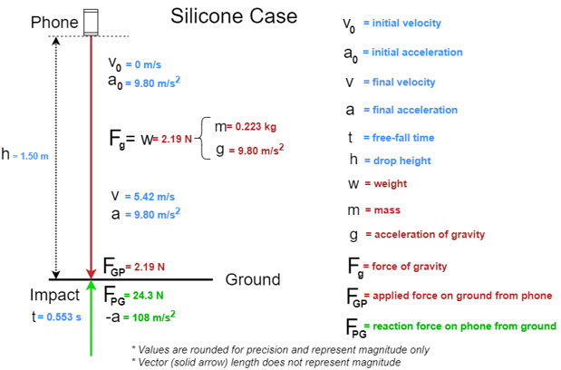
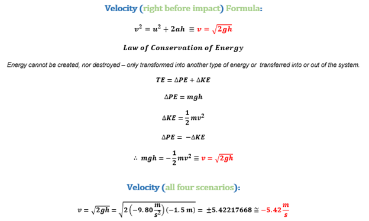
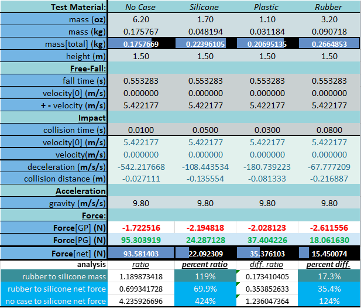
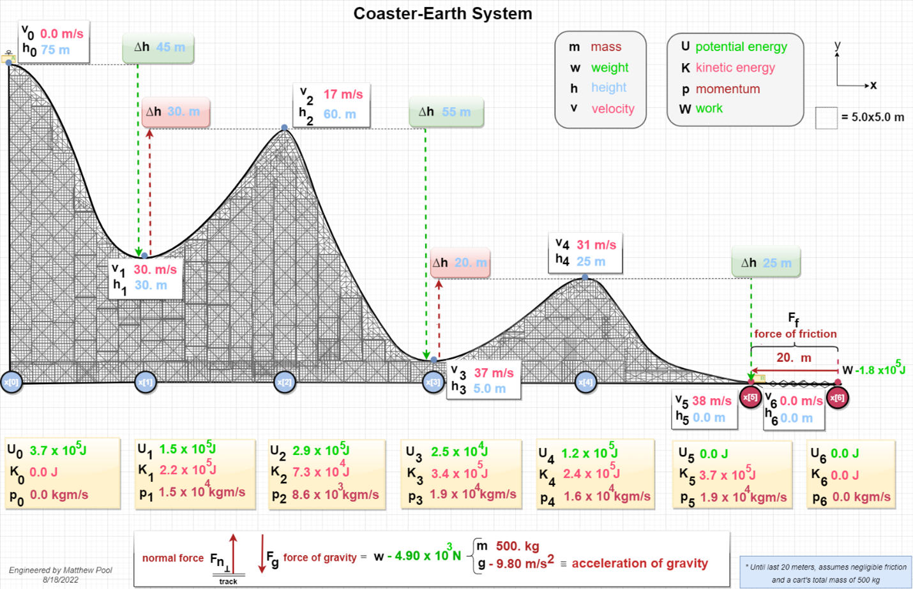
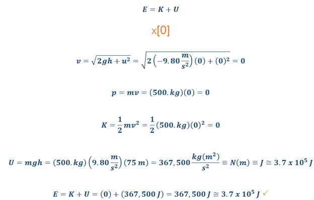
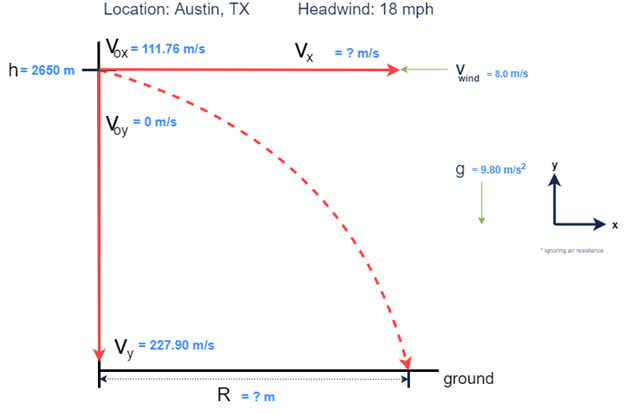
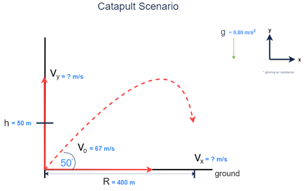
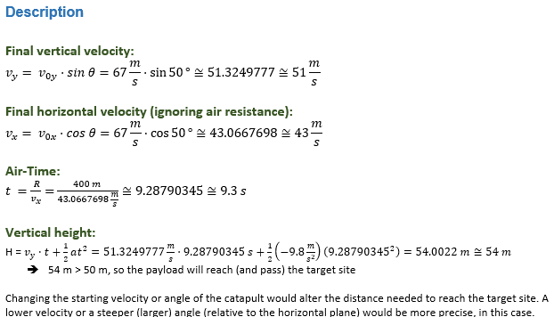

### (1) Phone Case Material Evaluation Report:
Comparison of the Newtonian physics involved in a dropped phone with varying case states (no case, silicone case, plastic case, rubber case). Project includes mechanical and mathematical analysis. A custom spreadsheet was create to use for calculating different mathematical properties and values.

### (2) Roller Coaster Design Report:
Custom roller coaster design that follows the laws of physics (minus negligible friction). Report includes graphical design, as well as the physics and mathematics involved.
    

### (3) Supply Drop Plan:
Diagramming and calculations of various supply drop and catapult scenarios.

