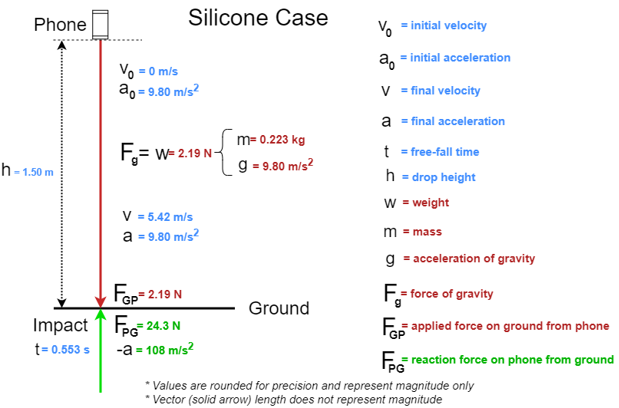
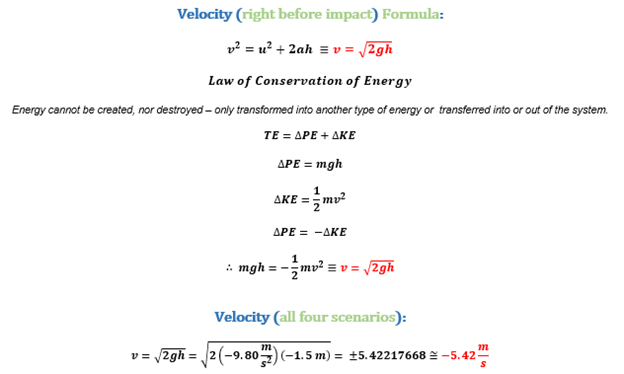
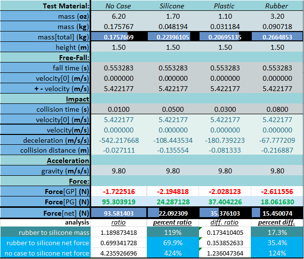
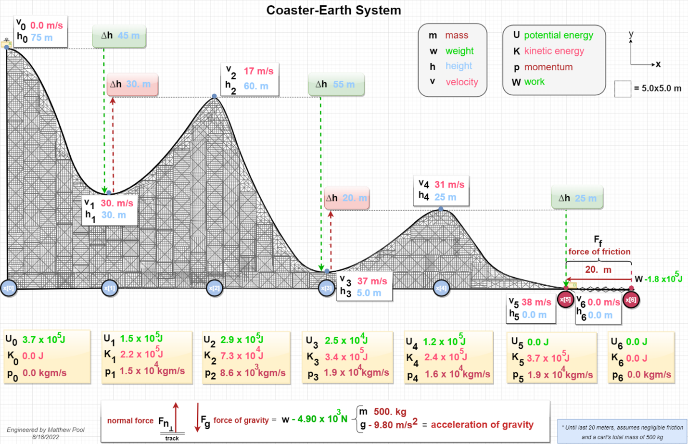
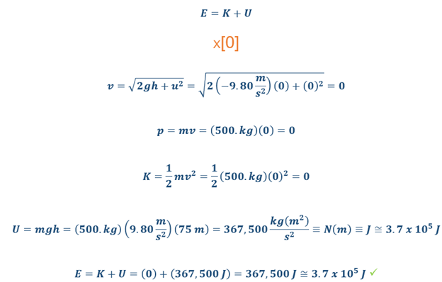

### (1) Phone Case Material Evaluation Report:
    Comparison of the Newtonian physics involved in a dropped phone with varying case states (no case, silicone case, plastic case, rubber case). Project includes mechanical and mathematical analysis. A custom spreadsheet was used to calculate and display different mathematical properties and values.

  
  
  

### (2) Roller Coaster Design Report:
    Custom roller coaster design that follows the laws of physics. Report includes graphical design, as well as the physics and mathematics involved.
    
  
  