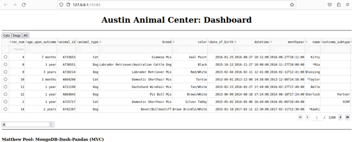
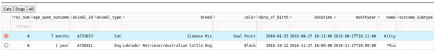
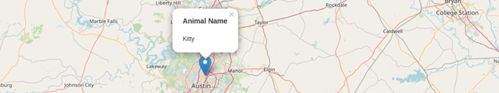
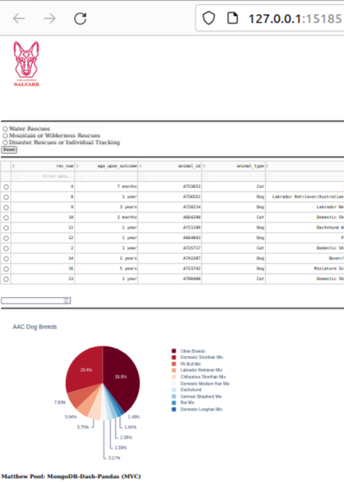

# FULL README (docx): https://github.com/matthew-pool/portfolio/blob/main/%5BPython-MVC%5D%20AAC%20Dashboard/README.docx
     
 
# Austin Animal Center - Dashboard 

This project utilizes a Model-View-Controller (MVC) software design pattern, with a Dash dashboard (View), a MongoDB database (Model), and callback functions (Controller). The Dashboard for Grazioso Salvare is designed to interact with the Austin Animal Center (AAC) ‘animals’ collection, which holds data for cats and dogs that the AAC currently houses. The dashboard integrates with the custom mongo_crud.py module’s MongoCrud class to abstract away the tedious nature of connecting to a MongoDB database and executing basic CREATE, READ, UPDATE, and DELETE (CRUD) operations. The user can create new documents to be inserted into the ‘animals’ collection of the’ AAC’ database,  view (read) documents in the database by using custom query filters, update documents, and delete documents based on matching queries. More on functionality later.

