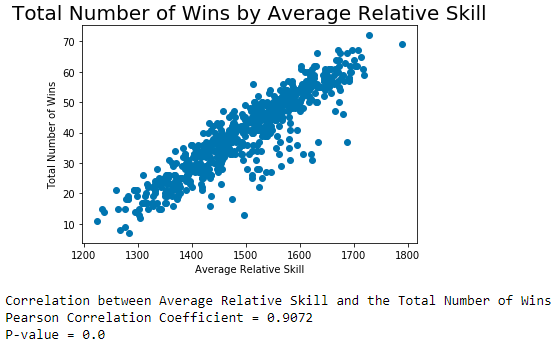
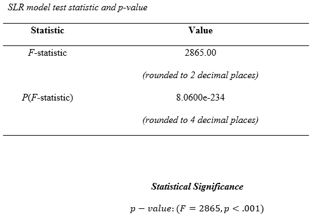
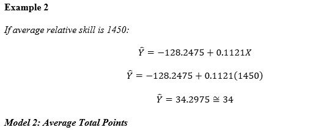
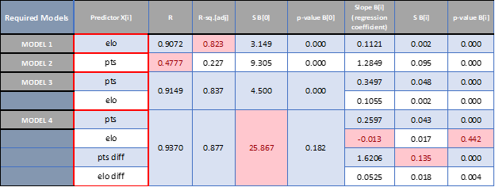

### (1) Project Summary Report:
Statistical analysis of the nba_wins_data.csv file, which is based on the FiveThirtyEightNBA Elo historical dataset. This analysis has the intent to predict the number of NBA regular-season wins. 

### (2) Regression Summary Chart:
Custom Excel spreadsheet for regression analysis.
