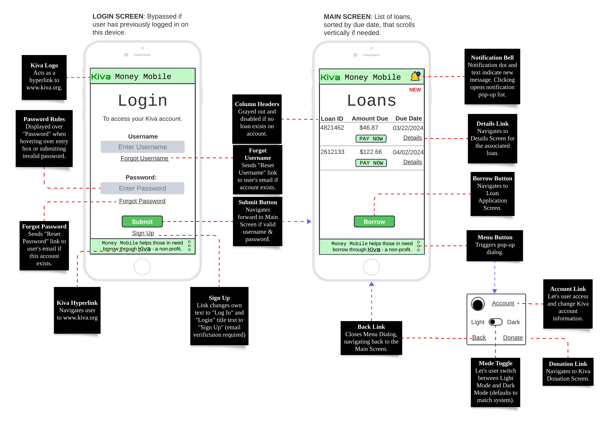
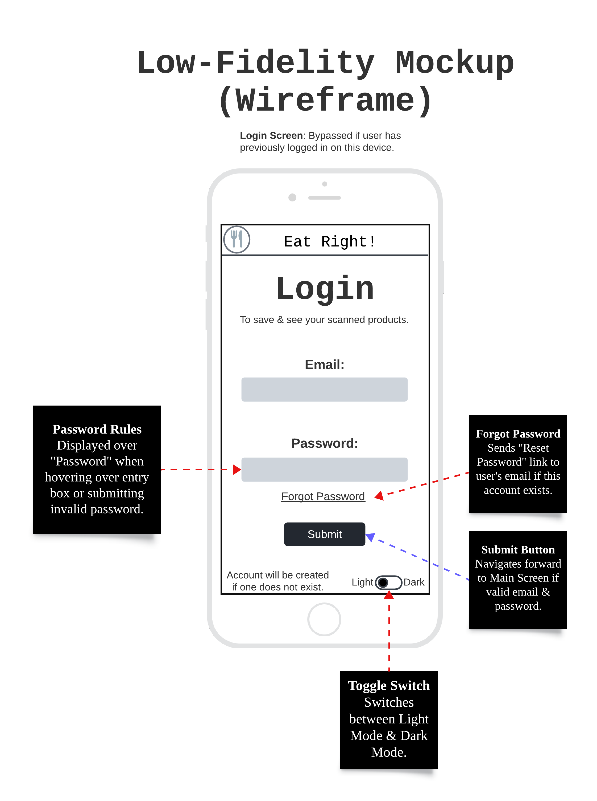
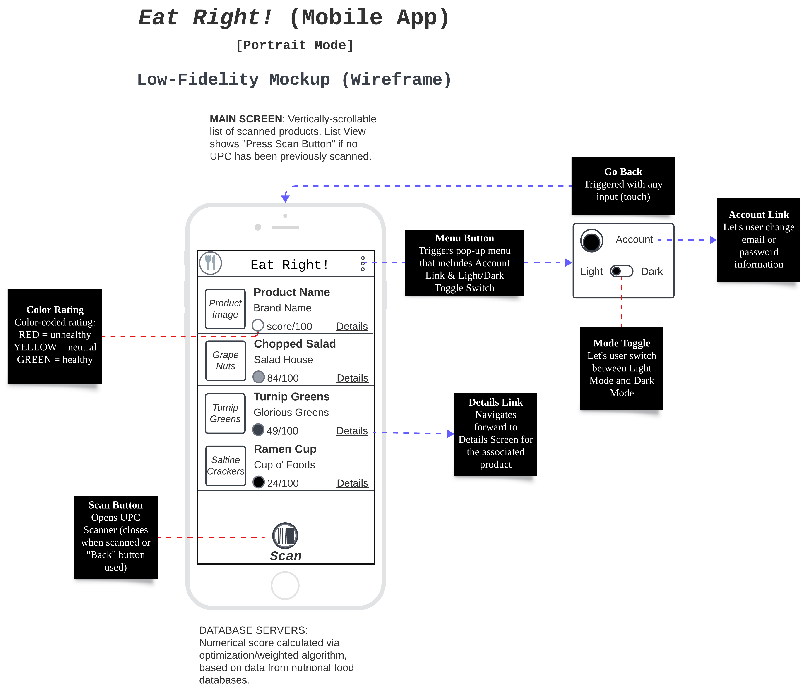

#### These projects showcase my understanding of user experience and user interface design.

### (1) Kiva - Money Mobile
UI/UX design of a mobile consumer app alongside a cloud-based web app. The consumer app is designed to provide a means to apply for a loan through Kiva - a non-profit. Lenders from around the world use the cloud app to provide loans for low-income applicants.

### (2) Eat Right!
UI/UX design of a mobile app designed to help you understand the health aspects of the food you eat.

